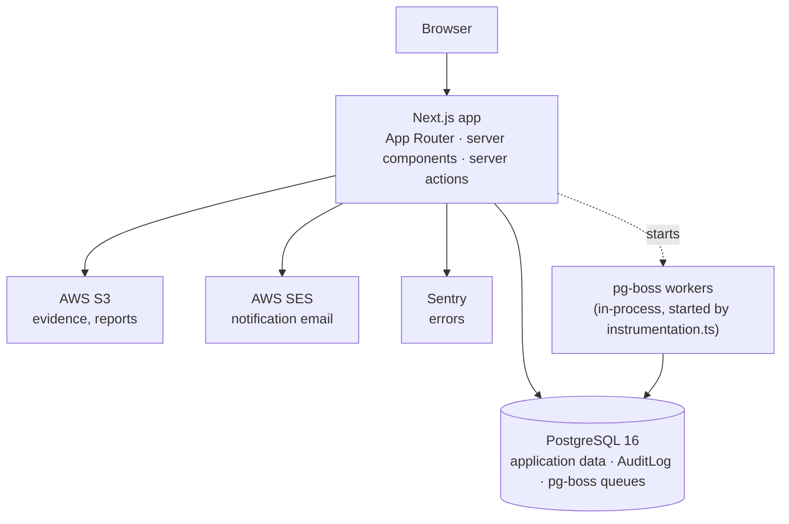
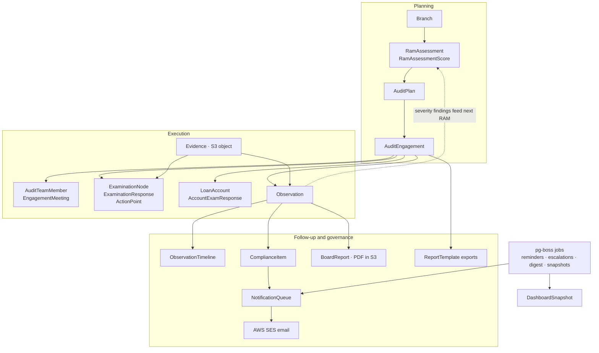
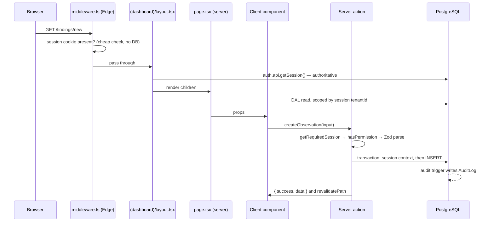

# Architecture

How AEGIS is put together, and the rules that hold it together.

This is a **hand-written** document about structure and intent. It deliberately
does not list tables, routes or actions — those are generated into
[`reference/`](reference/) from the source and will always be more current than
prose. Read this to understand _why_ the code is shaped the way it is; read the
reference to find out _what_ exists.

- **What exists** → [`reference/data-dictionary.md`](reference/data-dictionary.md),
  [`reference/routes.md`](reference/routes.md),
  [`reference/api-reference.md`](reference/api-reference.md),
  [`reference/data-flows.md`](reference/data-flows.md)
- **What it must do** → [`requirements/SRS.md`](requirements/SRS.md)
- **What the words mean** → [`../CONTEXT.md`](../CONTEXT.md)
- **How to run and release it** → [`../CLAUDE.md`](../CLAUDE.md), [`ops/`](ops/)

---

## Table of contents

- [The shape of the system](#the-shape-of-the-system)
- [Audit lifecycle data flow](#audit-lifecycle-data-flow)
- [Layers, and the rules between them](#layers-and-the-rules-between-them)
- [One request, end to end](#one-request-end-to-end)
- [Invariant 1 — tenant isolation](#invariant-1--tenant-isolation)
- [Invariant 2 — audit attribution](#invariant-2--audit-attribution)
- [Invariant 3 — authorization](#invariant-3--authorization)
- [Domain logic: pure engines](#domain-logic-pure-engines)
- [State machines](#state-machines)
- [Background jobs](#background-jobs)
- [Files, exports and email](#files-exports-and-email)
- [Internationalisation](#internationalisation)
- [Build and runtime configuration](#build-and-runtime-configuration)
- [Testing strategy](#testing-strategy)
- [Where the map is thin](#where-the-map-is-thin)
- [Adding a feature](#adding-a-feature)

---

## The shape of the system

A single Next.js App Router application, server-rendered, talking to one
PostgreSQL database. There is no separate API service, no message broker, no
cache tier. Everything that looks like infrastructure is either PostgreSQL or
AWS. Nothing sits in front of the app today — AEGIS is not deployed, so there
is no reverse proxy and no TLS termination; the retired Coolify layout put
Traefik there (see [`CLAUDE.md` § Deployment](../CLAUDE.md#deployment)).



Two consequences worth internalising:

- **The job queue lives in the application database.** pg-boss uses the same
  `DATABASE_URL` as Prisma and its workers run inside the web process, started
  from `src/instrumentation.ts` on boot. There is no worker deployment to scale
  or restart separately — and equally, a job that wedges affects the web process.
- **S3 and SES are optional at boot.** `src/env.ts` marks every AWS variable
  `.optional()`, so the app starts without them; evidence upload and email are
  simply non-functional until they are configured. They do not fall back to a
  working local default, so a missing variable shows up as a broken feature, not
  a failed deploy.

## Audit lifecycle data flow

How business data moves through the product — from branch risk scoring to board
reporting. Tables named here are the durable records; the process→table map in
[`reference/data-flows.md`](reference/data-flows.md) lists every module that
touches them directly.



Reading left to right:

1. **Planning** scores each branch (`RamAssessment`), builds the annual
   `AuditPlan`, and opens an `AuditEngagement` per visit.
2. **Execution** attaches the team and meetings, runs RBIA examination and
   sample-based account work, and raises formal `Observation` records (plus
   lighter `ActionPoint`s). Evidence lands in S3; the row points at the key.
3. **Follow-up** appends an immutable `ObservationTimeline`, tracks remediation
   on `ComplianceItem`, and escalates through `NotificationQueue` → SES. Board
   packs and other exports read the same observations and engagements.
4. **Closed-loop**: prior-year observations feed the next RAM cycle; scheduled
   jobs write reminders, escalations, digests and dashboard snapshots without a
   browser session.

Every write to an audited table in this path must go through
`withAuditedMutation` so the PostgreSQL trigger can attribute the change — see
[Invariant 2](#invariant-2--audit-attribution).

## Layers, and the rules between them

| Layer             | Directory                              | Runs on         | May import                      |
| ----------------- | -------------------------------------- | --------------- | ------------------------------- |
| Pages & layouts   | `src/app/`                             | Server (mostly) | data-access, guards, components |
| API routes        | `src/app/api/`                         | Server          | data-access, lib                |
| Server actions    | `src/actions/`                         | Server          | data-access, lib, validations   |
| Data access (DAL) | `src/data-access/`                     | Server only     | `lib/prisma`, `lib/auth`        |
| Domain engines    | `src/lib/*-engine.ts`, `src/services/` | Anywhere        | Prisma **types** only           |
| Components        | `src/components/`                      | Server + client | UI primitives, types            |
| Jobs              | `src/jobs/`                            | Server (worker) | data-access, lib                |

The rules, in order of how much damage breaking them does:

1. **`src/data-access/` is `server-only`.** Every module opens with
   `import "server-only"`, which makes importing one from a `"use client"`
   component a build error rather than a leaked database handle. Import _types_
   from the DAL freely with `import type`; import functions never.
2. **Domain engines are pure.** `src/lib/*-engine.ts`, `state-machine.ts`,
   `instance-scoring.ts` and `src/services/risk-rating/` take plain values and
   return plain values. No Prisma client, no `fetch`, no clock beyond what is
   passed in. This is what makes them unit-testable without a database, and it
   is why every one of them has a test file while most of the rest of the code
   does not.
3. **Components do not fetch.** Server components call DAL functions and pass
   plain data down as props; client components receive props and call server
   actions. There is no data fetching inside a client component.
4. **Mutations go through server actions, not API routes.** The HTTP
   endpoints under `src/app/api/` (inventoried in
   [`reference/routes.md`](reference/routes.md)) exist for things that fit HTTP
   better: Better Auth's handler, health, file downloads, streamed XLSX/PDF
   exports, an external cron trigger, and two authenticated JSON endpoints the
   client fetches (`/api/dashboard`, `/api/is-audit/checklist`). Exception:
   `POST /api/reports/board-report` mutates through an API route (PDF → S3 →
   audit row), so report-permission changes must cover it, not just
   `src/actions/`.

## One request, end to end

Creating an observation, as a worked example of the conventions:



Note the two-layer auth. `src/middleware.ts` runs in the Edge runtime and
therefore _cannot_ import `@/lib/auth` — Better Auth and Prisma pull in Node
built-ins that do not exist there. So middleware does an optimistic cookie
check for UX, and `(dashboard)/layout.tsx` does the authoritative session
validation before any child renders. **Middleware is not the security
boundary.** Deleting the middleware check would be a UX regression; deleting the
layout check would be a vulnerability.

Server actions return a discriminated result rather than throwing:

```ts
return { success: false as const, error: "…" };
return { success: true as const, data };
```

Callers branch on `success` and surface `error` in a toast. An action that
throws produces an opaque Next.js error digest in production, which is why the
convention exists.

## Invariant 1 — tenant isolation

**Tenant isolation is enforced in application code. PostgreSQL row-level
security is not enabled.**

This surprises people, because
`prisma/migrations/superseded/add_rls_policies.sql` exists and
`prismaForTenant(tenantId)` reads like an RLS helper. Neither is what it
appears:

- The RLS file is quarantined history. It is applied to **no** database and
  must not be — the gotcha in [`CLAUDE.md`](../CLAUDE.md#gotchas) explains
  what it would do to a system whose reads never set the tenant GUC.
- `prismaForTenant()` validates that the tenant id is a well-formed UUID and
  returns the shared singleton client. It adds no filtering of its own.

It used to wrap every query in a transaction with `SET LOCAL`, which was a no-op
without policies _and_ caused P2028 transaction timeouts under parallel SSR load
— a dashboard fires 10–15 queries at once and they competed for pool
connections. That wrapping was removed (see the architecture note in
`src/lib/prisma.ts`).

What actually keeps tenants apart:

1. `tenantId` comes from `getRequiredSession()` and **nowhere else** — never
   from a URL parameter, request body or query string.
2. Every query carries an explicit `where: { tenantId }`. **This is the whole
   control.** Know exactly what backs it up:
   - `src/data-access/__tests__/tenant-isolation.test.ts` **fails the build**
     on two things: a DAL `findMany` with no `where` clause at all (the shape
     `getUsers()` once shipped — a one-file, shrink-only allowlist covers the
     global RBI reference tables), and a DAL module missing `server-only`. Its
     older checks — a filtered `findMany` whose `where` lacks `tenantId`, raw
     `prisma` imports — only `console.warn`, and nothing static covers
     `findFirst`/`count`/aggregates or any query in `src/actions/`.
   - The read-side assertion ("throw if a returned row's `tenantId` doesn't
     match") exists in only ~8 of 51 DAL modules, some returning `null`
     instead of throwing.

Outside the two enforced checks, a dropped `WHERE tenantId` is caught by code
review or nothing — review every query in a DAL or action diff for the tenant
predicate.

The full pattern, with examples, is in
[`src/data-access/README.md`](../src/data-access/README.md).

> If RLS is ever switched on, it consumes the same `app.current_tenant_id`
> setting the audit trigger already reads — it would be an additional layer, not
> a replacement for the `WHERE` clauses.

### The connection-pool trap

`src/lib/prisma.ts` exports the client through a `Proxy` that caches the
singleton on `globalThis` **unconditionally**. An earlier version cached only
outside production, which meant that under `next start` every property access
constructed a fresh `PrismaClient` with its own 25-connection pool — an unbounded
leak that exhausted PostgreSQL under load. Do not reintroduce a
`NODE_ENV`-conditional cache.

## Invariant 2 — audit attribution

Audited tables carry an `AFTER INSERT/UPDATE/DELETE` trigger that writes to
`AuditLog`. The trigger reads _who_ and _why_ from transaction-scoped PostgreSQL
session settings, so the mutation and its attribution must share a transaction
(the write path is diagrammed in
[`reference/data-flows.md`](reference/data-flows.md), which regenerates with
the code — this document does not duplicate it).

`src/lib/session-context.ts` owns the contract — the six setting names, their
ordering, and how an `Actor` maps onto them. `src/data-access/audited-mutation.ts`
is the only sanctioned way to open such a transaction:

```ts
await withAuditedMutation(userActor(session), "observation.created", async (tx) => {
  return tx.observation.create({ data: { … } });
});

// Four actions are compiler-enforced to require a justification (DE6):
// finding.closed, user.role_changed, compliance.marked_na, observation.status_changed
await withAuditedMutation(actor, "finding.closed", fn, "Remediated in full");
```

Three details that matter:

- **An `Actor` is a user or the system.** Scheduled work uses
  `systemActor(tenantId)`, which deliberately leaves `app.current_user_id`
  _unset_ so the trigger records the platform acting under policy rather than
  attributing a change to a person who did not make it.
- **One transaction carries one tenant.** The context holds a single
  `app.current_tenant_id`, so cross-tenant work must group by tenant and call
  the wrapper once per group. Every job in `src/jobs/` loops tenants for exactly
  this reason.
- **Session GUCs read back as `''`, not NULL,** on a pooled connection that has
  previously set them, and `''::UUID` throws. Any SQL that reads one must wrap
  it in `NULLIF(current_setting(...), '')` — see
  `prisma/migrations/20260826_audit_trigger_null_safe.sql`.

A mutation made outside the wrapper does not produce an unattributed row — it
**fails**. The trigger normalises an unset tenant to `NULL`, and
`AuditLog.tenantId` is `NOT NULL`, so the audit insert aborts and takes the
business write down with it (`prisma/migrations/20260826_audit_trigger_null_safe.sql`
explains why that is deliberate). Historically the failure went unnoticed
because callers wrap side effects in catch-alls.
`src/data-access/__tests__/audited-mutation-discipline.test.ts` therefore scans
the source and fails the build on any unwrapped write to an audited table,
before it can reach a database.

**Legacy call sites.** 63 action files predate the wrapper and set the context
by hand via `setAuditContext` from `src/data-access/audit-context.ts`. They
work, and the discipline test allowlists them under a ceiling (67) that may
only ever be lowered. New code must use `withAuditedMutation`; touching an
allowlisted file is a good opportunity to migrate it and lower the ceiling.

**Which tables are audited** is declared in three places that must agree:
`AUDITED_TABLES` in `src/lib/audit-triggers.ts`, the `audited` array in
`prisma/sql/020_attach_audit_triggers.sql`, and `AUDIT_TRIGGER_TABLES` in
`prisma/sql/manifest.ts`; `src/lib/__tests__/sql-manifest.test.ts` fails the
build if they drift. 24 tables carry the trigger, including the eight RBIA/GRC
scoring tables an examiner would ask for a change history on (`RamAssessment`,
`RamAssessmentScore`, `ExaminationResponse`, `AuditExaminationResponse`,
`AccountExamResponse`, `ActionPoint`, `BranchRbiaScore`, `LoanAccount`).
`src/lib/__tests__/audit-coverage.test.ts` pins that set: a regulated table
leaving the list fails the build, and its exemption set is empty and may only
shrink. Because the trigger fails an un-contexted write, a table can only join
the list once every write path to it sets the context — attach the trigger
last. Seeds and integration fixtures do not set context; they detach the
triggers around their inserts with `withTriggersDetached` instead.

A database built by `prisma db push` alone has **no** triggers — they come from
`pnpm db:bootstrap`, and adding a table needs no dated migration because the
attach script is idempotent.

## Invariant 3 — authorization

Roles are a Prisma enum (17 of them); permissions are a TypeScript union (78) in
`src/lib/permissions.ts`. Users hold an _array_ of roles, and their effective
permissions are the **union** across all of them, so every check is
`roles.includes(...)`-shaped, never `role === ...`.

Enforcement happens at three points, and all three are load-bearing:

| Point               | Mechanism                                                                       | What it protects                               |
| ------------------- | ------------------------------------------------------------------------------- | ---------------------------------------------- |
| Page                | `requirePermission(...)` / `requireAnyPermission(...)` from `src/lib/guards.ts` | Navigating to a route                          |
| Server action       | `hasPermission(session.user.roles, "…")` early return                           | Performing the mutation                        |
| Workflow transition | State-machine guards                                                            | Performing it _at this point in the lifecycle_ |

Page guards redirect to `/dashboard?unauthorized=true` rather than rendering a
403, so an unauthorized user lands somewhere useful.

The third row is the one that encodes maker-checker. Severity-based closing is
the clearest example: `AUDIT_MANAGER` may close LOW/MEDIUM observations,
`CAE` is required for HIGH/CRITICAL. That is a property of the transition, not
of the page, so it lives in `src/lib/state-machine.ts`.

> **Coverage is uneven.** 17 of 65 pages call a permission guard. The rest rely
> on the layout's session check plus action-level and DAL-level enforcement — so
> a user without permission cannot _do_ anything, but may be able to _load_ a
> page. See [Where the map is thin](#where-the-map-is-thin).

## Domain logic: pure engines

The regulatory arithmetic is isolated from I/O so it can be tested exhaustively
and reviewed against RBI policy without reading Prisma code.

| Module                            | Computes                                 | Rule of note                                                                                                                                                                         |
| --------------------------------- | ---------------------------------------- | ------------------------------------------------------------------------------------------------------------------------------------------------------------------------------------ |
| `lib/ram-engine.ts`               | Branch risk composite score              | Weighted average of 1–5 parameter scores, normalised by total weight. HIGH >3.5 → 12mo, MEDIUM 2.5–3.5 → 18mo, LOW <2.5 → 24mo audit frequency. Repeat findings apply a 1.5× uplift. |
| `lib/rbia-scoring-engine.ts`      | RBIA node → module roll-up               | 4-point scale (1.0 / 0.75 / 0.5 / 0.0). A critical item scored NON_COMPLIANT **caps** the module at 0.5 — a ceiling, not a floor.                                                    |
| `lib/instance-scoring.ts`         | Per-question compliance % → `ScoreLabel` | Bridges sample-based account responses into the RBIA scoring engine.                                                                                                                 |
| `lib/sampling-engine.ts`          | Deterministic sample selection           | Bucket-fill across five criteria buckets whose percentages must sum to 100.                                                                                                          |
| `lib/escalation-engine.ts`        | Overdue → escalation level               | L1 +15d, L2 +30d, L3 +90d, L4 +180d; L0 is within grace.                                                                                                                             |
| `lib/escalation-router.ts`        | Escalation level → recipients            | L1 Branch+IAD, L2 Zonal Auditor, L3 ACE Officer, L4 ACB Member + CAE.                                                                                                                |
| `services/risk-rating/compute.ts` | Engagement rating band                   | Inverted scale — fewer and lower-severity findings produce a _higher_ percentage.                                                                                                    |

`lib/repeat-finding-detector.ts` is the exception that proves the rule: it needs
the database (pg_trgm title similarity above 0.5, plus explicitly linked
`repeatOfId` records), so it is `server-only` and lives outside the pure set.

## State machines

Two lifecycles are modelled as explicit transition tables rather than status
strings scattered through actions.

**Observations** — `src/lib/state-machine.ts`, 7 states
(`DRAFT → SUBMITTED → REVIEWED → ISSUED → RESPONSE → COMPLIANCE → CLOSED`),
8 transitions (6 forward, 2 returning). The state diagram lives in
[`reference/data-flows.md`](reference/data-flows.md), which regenerates with
the code.

**Engagements** — `src/lib/engagement-state-machine.ts`, 8 states:
`PLANNED → TEAM_ASSIGNED → OPENING_MEETING → IN_PROGRESS → EXIT_MEETING →
REPORT_DRAFT → COMPLETED`, with any non-terminal state able to reach
`CANCELLED`.

Engagement transitions carry **prerequisite guards** as well as role guards, so
the machine encodes audit practice: a team must be assigned before fieldwork,
meetings must be recorded before and after it, and the branch score must be
frozen before an engagement can complete.

Only the **engagement** machine is typed as `Record<EngagementStatus, …>`,
which means adding a status to that Prisma enum produces a TypeScript error
until the transition map is updated — do not widen the type to silence it. The
**observation** machine's `TRANSITIONS` is a flat `TransitionDef[]` with no
compile-time exhaustiveness: adding an `ObservationStatus` value builds
cleanly, and observations entering the new state simply have no available
transitions. When touching that enum, update the transition array by hand and
extend `src/lib/__tests__/state-machine.test.ts` to cover the new state.

## Background jobs

pg-boss queues and schedules live in `src/lib/job-queue.ts`; handlers live in
`src/jobs/` and are registered from `src/jobs/index.ts`. All cron is UTC; IST is
UTC+05:30.

| Job                     | Schedule (UTC) | Local         | Does                                                                                        |
| ----------------------- | -------------- | ------------- | ------------------------------------------------------------------------------------------- |
| `process-notifications` | `* * * * *`    | every minute  | Dequeues `NotificationQueue`, renders the template, sends via SES, marks SENT/FAILED        |
| `deadline-check`        | `30 0 * * *`   | 06:00 IST     | Observation deadline reminders at 7/3/1 days; also runs RBIA BM-response overdue escalation |
| `send-weekly-digest`    | `30 4 * * 1`   | Mon 10:00 IST | Per-tenant digest to CAE/CCO (who cannot opt out — regulatory)                              |
| `snapshot-metrics`      | `30 19 * * *`  | 01:00 IST     | Writes health score, compliance summary and severity breakdown into `DashboardSnapshot`     |

Queues retry 3 times with backoff and delete after 30 days. Conventions vary
more per job than you would hope:

- Every job iterates tenants, because one audited transaction carries one
  tenant. The deadline and escalation jobs wrap their writes in
  `withAuditedMutation(systemActor(tenantId), …)` once per tenant;
  `weekly-digest` wraps once per **recipient**; and `snapshot-metrics` uses no
  wrapper at all — legitimately, because `DashboardSnapshot` is not an audited
  table. Do not copy `snapshot-metrics` as a template for a job that writes an
  audited table.
- Reminder dedup checks `NotificationQueue` — not `EmailLog` — for a row of
  the same type for the same observation **created since local midnight**
  (`deadline-reminder.ts`). Purging old `NotificationQueue` rows re-arms the
  guard; conversely, a queued row whose SES send later fails still suppresses
  that day's retry.
- Only `snapshot-metrics` batches tenants (10 at a time) to protect the pool;
  the other jobs iterate tenants sequentially, so their runtime grows linearly
  with tenant count.

Compliance escalation runs from this scheduler like the rest. The former
`/api/cron/escalation` external trigger has been removed: middleware required a
session cookie before its route-level Bearer check, so it was unreachable in
practice, and a second auth scheme on a publicly routable endpoint was not worth
keeping for a job the scheduler already owns.

## Files, exports and email

**Evidence upload** is presigned-PUT direct to S3; the application never proxies
file bytes. Keys are tenant-first by convention:

```
${tenantId}/evidence/${observationId}/${uuid}.${ext}
${tenantId}/bm-evidence/${actionPointId}/${uuid}.${ext}
${tenantId}/reports/${year}/${quarter}/${reportId}.pdf
```

**Download authorization** (`src/lib/authorize-download.ts`) is what makes that
convention a security control. It splits the key on `/` and compares the whole
first segment to the session's tenant id. The comparison is deliberately
segment-based rather than `startsWith`, because a prefix test would let tenant
`abc` match `abcdef/...`. One legacy namespace (`audit-reports/<tenantId>/…`) is
tenant-_second_ and has an explicit branch; that branch must not be removed
until the generators and stored keys are migrated.

The route itself is pinned by `src/app/api/download/__tests__/route.test.ts`,
which exercises `GET /api/download` with the real authorizer wired in and
asserts that a presigned URL is only minted for the session tenant's key, that
authorization runs before presigning, and — as a source invariant — that the
tenant is never read from the request. The original bug (#46) was not a wrong
function but a route that never called one, which a function-level test cannot
catch.

**Exports** are streamed from API routes rather than server actions, because
they produce binary payloads: ExcelJS for XLSX, `@react-pdf/renderer` for PDF.
Both, plus `pg-boss`, are listed in `serverExternalPackages` in
`next.config.ts` — they do not survive bundling and must be required at runtime.

**Email** is React Email templates in `src/emails/`, rendered by the
notification processor and sent through SES. Nothing sends email synchronously
from a request; everything enqueues a `NotificationQueue` row and lets the
minute-ly worker deliver it.

## Internationalisation

`next-intl`, with the locale read from a `NEXT_LOCALE` cookie in
`src/i18n/request.ts` and validated against `["en", "hi", "mr", "gu"]` — an
unrecognised value silently falls back to `en`. There is **no locale path
segment**: URLs are identical across languages. Dictionaries are
`messages/<locale>.json`.

## Build and runtime configuration

- **Environment** is a single Zod schema in `src/env.ts`, imported by
  `next.config.ts` so validation runs at build time (`SKIP_ENV_VALIDATION=1`
  bypasses it for Docker builds). The variable contract — which four are
  required, what degrades without the rest — lives in
  [`CLAUDE.md`](../CLAUDE.md#environment-notes), not here.
- **`NEXT_PUBLIC_*` variables are baked at build time**, so changing one
  requires a rebuild, not a restart.
- **Security headers** — CSP, HSTS, `X-Frame-Options: DENY`, `nosniff`,
  `Referrer-Policy` and a `Permissions-Policy` — are set for all routes in
  `next.config.ts`. The CSP allows `'unsafe-inline'` for scripts and styles and
  `'unsafe-eval'` in development only. The S3 origin is listed in both
  `img-src` and `connect-src`; the Sentry ingest origin is in `connect-src`
  only.
- **Server action body limit** is 5 MB.
- **Output** is `standalone` for Docker, but disabled under `CI` because
  `next start` is incompatible with standalone output in the E2E job.
- **Session** is Better Auth with database-backed sessions: 10 sign-ins per IP
  per 15 minutes, lockout after 5 failures for 30 minutes, at most 2 concurrent
  sessions per user, and `httpOnly` + `sameSite=lax` cookies with `secure`
  derived from whether `BETTER_AUTH_URL` is HTTPS.

## Testing strategy

| Kind        | Tool                    | Where                                                      | Roughly                                                                                                                              |
| ----------- | ----------------------- | ---------------------------------------------------------- | ------------------------------------------------------------------------------------------------------------------------------------ |
| Unit        | Vitest                  | `src/**/__tests__/`                                        | Concentrated on the pure engines and state machines, plus route handlers with their I/O mocked                                       |
| Discipline  | Vitest, static analysis | `src/data-access/__tests__/`, `src/lib/__tests__/`         | Suites that read source text, no database — see below                                                                                |
| Integration | Vitest, live PostgreSQL | `src/**/__integration__/`, harness in `tests/integration/` | `pnpm test:integration`: real transactions, real triggers. Global setup **resets** the `DATABASE_URL` database                       |
| E2E         | Playwright              | `tests/e2e/`                                               | 3 spec files (observation lifecycle, permission guards, smoke), replayed under 5 role projects (auditor, manager, cae, cco, auditee) |

The discipline suites enforce different amounts.
`audited-mutation-discipline.test.ts` fails the build on any unwrapped write to
an audited table, with a shrink-only allowlist for legacy `setAuditContext`
sites. `tenant-isolation.test.ts` fails the build on a DAL `findMany` with no
`where` clause and on a DAL module missing `server-only`; its remaining checks
only warn — the precise boundary is under
[Invariant 1](#invariant-1--tenant-isolation). `sql-manifest.test.ts` and
`audit-coverage.test.ts` hold the three audited-table declarations in sync and
keep the regulated tables on the list —
[Invariant 2](#invariant-2--audit-attribution). The `/api/download` route test
carries a source-invariant block in the same idiom —
[Files, exports and email](#files-exports-and-email).

CI runs `lint` (which includes `pnpm docs:check`), `typecheck`, `build`,
`docker-build`, `unit-test`, `integration-test`, `e2e-smoke` and
`security-audit` as gates on every pull request, plus the full `e2e` suite as an
advisory job, all against the merge ref (see
[`CLAUDE.md`](../CLAUDE.md#current-flow)).

## Where the map is thin

Documented honestly so nobody rediscovers these the hard way. Each links to
the section that owns the detail; the numbers live there, once.

- **Permission-guard coverage is not uniform** — most pages rely on the layout
  session check plus action- and DAL-level enforcement
  → [Invariant 3](#invariant-3--authorization).
- **Legacy audit writes** — 63 action files still hand-roll `setAuditContext`
  under a shrink-only allowlist → [Invariant 2](#invariant-2--audit-attribution).
- **`prisma db push` alone produces an incomplete database** — triggers, views
  and guards come from loose `.sql` files applied by hand, and they do not ride
  along with a deploy → [Invariant 2](#invariant-2--audit-attribution).
- **RLS ships as dead code.** The deliberate policy files were never applied;
  a bootstrap side effect enabled RLS on exactly one table
  (`ObservationRbiCircular`), inert because the app connects as a `BYPASSRLS`
  superuser. Verified against production in
  [`claims-vs-implementation.md`](claims-vs-implementation.md#resolution-of-the-open-rls-question-added-2026-08-27).
- **`WHERE tenantId` is only partially machine-checked** — the no-`where`
  `findMany` shape is enforced; everything else is code review
  → [Invariant 1](#invariant-1--tenant-isolation).
- **The DAL is a shared-query library, not a strict gateway** — most actions
  query directly → [`src/data-access/README.md`](../src/data-access/README.md).
- **E2E coverage is three spec files** — lifecycle, permission guards and a
  smoke pass; most modules have none → [Testing strategy](#testing-strategy).
- **Dead demo JSON.** `src/data/index.ts` still exports DEPRECATED seed JSON
  (`findings`, `auditPlans`, `bankProfile`, …), but the chain is orphaned: its
  consumers have no importers, and the live dashboard reads the database
  through `components/dashboard/widgets/*`. Prefer deleting over reviving.

## Adding a feature

The path of least resistance, which is also the one the discipline tests expect:

1. **Schema** — edit `prisma/schema.prisma`, then `pnpm db:generate` and
   `pnpm db:push`. If the table should be audited, first make sure every write
   to it will go through `withAuditedMutation` (the trigger fails un-contexted
   writes), then add it to the three declarations under
   [Invariant 2](#invariant-2--audit-attribution) — no trigger migration is
   needed. If it holds regulated scoring data, add it to `REGULATED_MODELS` in
   `src/lib/__tests__/audit-coverage.test.ts` so it cannot slip off the list.
2. **Pure logic first** — if there is arithmetic or a lifecycle rule, put it in
   `src/lib/` as a pure function with a test beside it. Do not let scoring rules
   grow inside a server action.
3. **Reads** — add a function to `src/data-access/`: `import "server-only"`,
   `getRequiredSession()`, `prismaForTenant(tenantId)`, explicit
   `where: { tenantId }`, assertion on the way out.
4. **Writes** — add a server action in `src/actions/<domain>/`: session,
   `hasPermission` check, Zod parse, then `withAuditedMutation(actor, "domain.event_past", …)`.
   Return `{ success, data }` / `{ success, error }`; never throw.
   `revalidatePath()` afterwards.
5. **Page** — a server component that calls `requirePermission()` and the DAL,
   passing plain data to client components. Style conventions (aliases, icons,
   `cn()`) are in [`CLAUDE.md`](../CLAUDE.md#code-style).
6. **Permission** — if you added one, extend the `Permission` union and the
   `ROLE_PERMISSIONS` map in `src/lib/permissions.ts`.
7. **Verify** — `pnpm lint`, `pnpm test:unit` (the discipline tests run here),
   `pnpm test:integration` if you touched a write path or the schema,
   `pnpm build`, and `pnpm docs:reference` to refresh the generated reference —
   CI's `docs:check` fails if it is stale.
